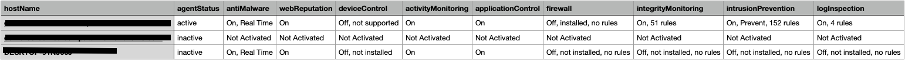

# Cloud One Agent Status Report

## What does this script do?

This script will loop through all your agents and builds a CSV report on all your agents status and the protection modules status. See example below:

### Pre-requisites:

    1. This script requires Python v3+
        - Required Python libraries: requests, json, and pandas
    1. Cloud One API key
        - Place your API KEY in the variable "C1_APIKEY = <YOUR API KEY HERE>"
    2. Specify region 
        - Specifiy your Cloud One region in the variable "C1_REGION = <YOUR REGION HERE>"

### Instructions:

    1. Clone/Download this repository to your local machine with Python installed.
    2. Navigate to the "workload_security_reports/agent_status_report" folder.
    3. Execute the script: "Python3 agent_module_status.py"
    4. After successfull execution it will place a file called "agent_module_status.csv" in the current directory.