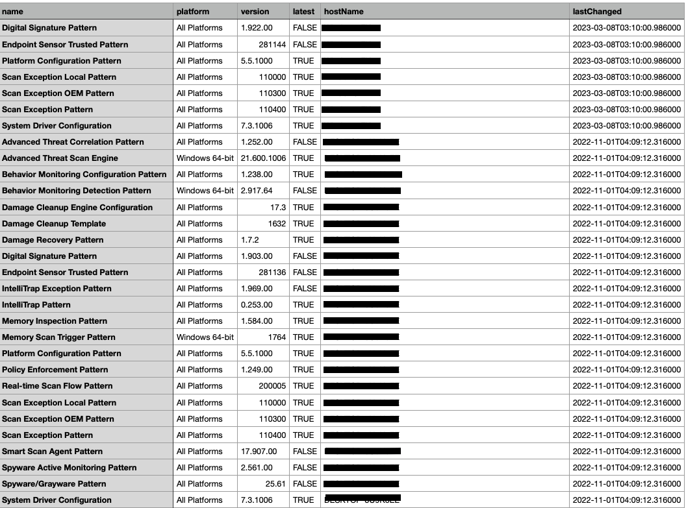

# Cloud One Agent Pattern Report 

## What does this script do?

This script loops through all agents in the Cloud One Workload Security console and builds a CSV report of the agents anti-malware pattern/engine versions. It will also show the last time these updates were successfully ran. See example of report below:

### Pre-requisites:

    1. This script requires Python v3+
        - Required Python libraries: requests, pandas, json, datetime, and pprint
    2.  The "DROP_LATEST" variable is used to drop the "latest" column from the CSV file which gives a "True" or "False" value if the agent is running the latest updates or not.
        - The defualt value of this is set to "True" you can change the value to "False" if you don't want this column in the CSV.
    3. Cloud One API key
        - Place your API KEY in the variable "C1_APIKEY = <YOUR API KEY HERE>"
    4. Specify region 
        - Specifiy your Cloud One region in the variable "C1_REGION = <YOUR REGION HERE>"

### Instructions:

    1. Clone/Download this repository to your local machine with Python installed.
    2. Navigate to the "workload_security_reports/agent_pattern_report" folder.
    3. Execute the script: "Python3 pattern_check.py"
    4. After successfull execution it will place a file called "agent_pattern_status.csv" in the current directory.