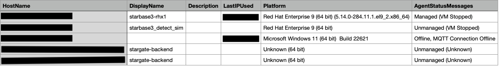

# Agent Status API

This script allows you to extract computer data from the Trend Micro Workload Security API endpoint and save it as a CSV file. It specifically extracts fields like HostName, DisplayName, Description, LastIPUsed, Platform, and AgentStatusMessages.

## Prerequisites

- Python 3.x installed on your system.
- Required Python libraries can be installed using `pip`. Run the following command to install them:

    ```bash
    pip install requests
    ```

## Getting Started

1. Clone this repository to your local machine:

    ```bash
    git clone https://github.com/jmlake569/workload_security_automation.git
    ```

2. Navigate to the project directory:

    ```bash
    cd workload_security_automation/agent_status
    ```

3. Open the `agent_status.py` script in a text editor of your choice.

4. Replace the `c1_headers` dictionary values with your actual API credentials.

5. Run the script using the following command:

    ```bash
    python3 agent_offline.py
    ```

6. The script will extract the computer data from the API and save it as a CSV file named `computer_data.csv` in the same directory.

## CSV Format

The CSV file will have the following columns:

- HostName
- DisplayName
- Description
- LastIPUsed
- Platform
- AgentStatusMessages

## Example Screenshot



## Notes

Workload Security API Reference: https://cloudone.trendmicro.com/docs/workload-security/api-reference/tag/Computers